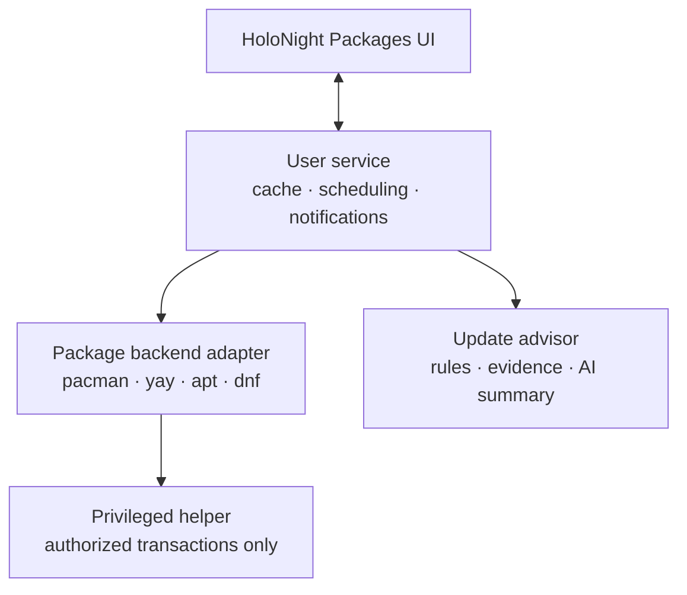

This should be a separate application and repository, with its own user service and a very small privileged transaction helper. HoloNight Shell should integrate with it, but it should not own package-management logic.

Repository structure and daemon architecture are independent decisions: even if it were another binary in `holonight-shell`, safe background work and privileged transactions would still require separate processes.

## Recommended product boundary

Create:

* `holonight-packages` — Qt Quick package-management application.
* `holonight-packaged` — unprivileged per-user service.
* `holonight-package-helper` — privileged, D-Bus-activated transaction helper.
* A small shell-facing D-Bus API for update count, status and notifications.

Keep in `holonight-shell` only:

* top-bar update indicator;
* small updates popup;
* notification presentation;
* action to launch/focus HoloNight Packages.

The full package browser, transaction history, AI reports and adapter implementations do not belong in the shell repository. They have different security, testing, release and portability concerns.

Your existing HoloNight Qt components—theme tokens, controls and eventually `HudFrame`—should be consumed as a shared dependency, just as HoloNight AI would consume them.



## Why it should be a separate repository

Package management is large enough to be a product rather than a shell widget:

* It should work when `holonight-shell` is not running.
* It will eventually have distro-specific dependencies.
* Package operations need much more extensive integration and security testing.
* A package transaction failure must not destabilize or crash the desktop shell.
* It may later be useful under another compositor or desktop.
* Releases may need to follow changes in pacman, DNF or APT independently of the shell.

I would name the repository `holonight-packages` or `holonight-package-center`. The latter communicates the user-facing purpose better, while `holonight-packages` fits your existing repository naming.

## The process split

### 1. UI process

A normal Qt Quick application. It never invokes `sudo`, `pkexec`, `pacman` or `yay` directly.

It communicates with the user service through D-Bus and receives structured objects such as:

* package metadata;
* transaction plans;
* progress events;
* questions and choices;
* update analysis;
* transaction results.

Closing the window must not terminate an active transaction.

### 2. Unprivileged user service

Run `holonight-packaged` as a systemd user service, preferably D-Bus activated.

Responsibilities:

* periodic update checks;
* local metadata and analysis cache;
* update-count state;
* desktop notifications;
* package search and read-only inspection;
* Arch News and changelog retrieval;
* AI-provider communication;
* coordination of transactions;
* transaction history.

This service should not run as root. Background scanning generally does not need root privileges.

### 3. Privileged helper

Use a small system D-Bus service, activated only when a transaction is requested and authorized through Polkit.

Responsibilities should be limited to operations such as:

* execute an already-resolved installation plan;
* remove packages;
* perform a system upgrade;
* refresh the real package database as part of an upgrade;
* return structured progress, prompts and results.

It must not expose something like:

```text
RunCommand(string command)
```

Instead, expose narrow operations with validated package identifiers and options. Re-resolve or validate the transaction immediately before execution because package databases may have changed since the UI showed the preview.

Ideally, the helper exits after an idle timeout. A permanent root daemon would create unnecessary attack surface.

## Package-manager abstraction

Be careful with the terminology:

| Distribution family | High-level backend          | Low-level package format/tool |
| ------------------- | --------------------------- | ----------------------------- |
| Arch                | pacman/libalpm              | Arch packages                 |
| Debian/Ubuntu       | APT                         | dpkg/`.deb`                   |
| Fedora/RHEL         | DNF/libdnf5                 | RPM                           |
| AUR                 | yay or another AUR workflow | PKGBUILD/makepkg              |

RPM and dpkg should not be treated as equivalent adapters to pacman, APT or DNF. They operate at a lower level and do not provide the complete repository/dependency workflow you want.

Your common adapter should represent capabilities rather than assume every backend supports exactly the same operations:

```cpp
struct BackendCapabilities {
    bool canSearch;
    bool canInstall;
    bool canRemove;
    bool canUpgradeSelected;
    bool canUpgradeSystem;
    bool supportsBuildRecipes;
    bool supportsChangelogs;
    bool supportsOfflineUpdates;
};
```

The domain model also needs to preserve source and trust:

```text
Package
  identity
  name
  installedVersion
  availableVersion
  sourceType: OfficialRepository | CommunityBuild | LocalFile | Flatpak
  repository
  installReason: Explicit | Dependency
  trustLevel
  backendSpecificId
```

Do not collapse official Arch packages and AUR packages into one indistinguishable list. The AUR is a build-recipe workflow with materially different trust and review requirements.

## PackageKit: useful, but not the foundation

PackageKit already offers a cross-distribution D-Bus abstraction with asynchronous transactions and pluggable backends. That makes it tempting for this project. [Its stated purpose is essentially the generic layer you described.](https://packagekit.freedesktop.org/gtk-doc/specification.html)

However, I would not build the HoloNight domain model around PackageKit:

* It represents a lowest common denominator.
* AUR support and PKGBUILD review do not fit naturally.
* Deep distro-specific transaction analysis will be difficult.
* Your update advisor needs more information than a generic install/remove interface exposes.

A good strategy is:

* native Arch adapter first;
* optional PackageKit adapter later for basic cross-distro support;
* native APT and DNF adapters if deeper integration becomes worthwhile.

## Arch backend

Arch is an excellent first implementation because pacman is already a frontend over `libalpm`, and the official documentation explicitly states that libalpm exists to support alternative frontends, including graphical ones. [pacman manual](https://man.archlinux.org/man/pacman.8)

### Read-only operations

Use libalpm for:

* installed package enumeration;
* official repository search;
* dependency information;
* installed/available versions;
* package groups;
* files, conflicts, replacements and optional dependencies;
* transaction simulation.

For background update checks, use a separate package database. `checkupdates` already follows this design, checking pending upgrades against a temporary database rather than altering the live sync database. [checkupdates manual](https://man.archlinux.org/man/extra/pacman-contrib/checkupdates.8.en)

This is important on Arch: the background checker should not casually perform the equivalent of a persistent `pacman -Sy`.

### Official transactions

Long term, execute official-repository transactions through libalpm inside the privileged helper. It gives you callbacks and structured transaction state without parsing localized terminal output.

For an initial prototype, invoking pacman is acceptable, but treat it as temporary. Never make parsing arbitrary pacman output the permanent public protocol between the service and UI.

### AUR transactions

AUR support deserves a separate adapter layered alongside the pacman adapter:

* Use the AUR RPC API for search and metadata.
* Use libalpm for local/official dependency state.
* Use yay for resolution/build/install initially.
* Show PKGBUILD source, changes and build logs.
* Run the build portion unprivileged.
* Clearly distinguish official dependencies from AUR build recipes.

Yay has interactive decisions around providers, diffs, clean builds and PKGBUILD editing, so the UI must support real transaction questions rather than automatically supplying `--noconfirm`. Yay itself emphasizes querying the user before builds and reviewing changes. [yay documentation](https://github.com/Jguer/yay)

Later you can decide whether to implement an AUR resolver yourself. Do not do that in the first version—it could easily become most of the project.

## AI update advisor

The most important design principle is:

> The AI explains an update assessment; it does not invent the assessment.

Use this pipeline:

1. Resolve the exact transaction.
2. Collect deterministic system facts.
3. Apply a rule-based risk/action engine.
4. Retrieve relevant release information.
5. Ask the LLM to summarize the evidence.
6. Present sources, confidence and unresolved uncertainty.

### Evidence to collect before an update

* exact old and new versions;
* packages being installed, removed or replaced;
* dependency/provider changes;
* official Arch News entries affecting those packages;
* security advisories;
* package and upstream changelogs where available;
* kernel currently running versus kernel being installed;
* NVIDIA/Mesa/kernel-module relationships;
* systemd, glibc, D-Bus, PipeWire, compositor and display-stack changes;
* configured bootloader and initramfs generator;
* pacman hooks expected to run;
* proposed `.pacnew`-sensitive packages;
* AUR PKGBUILD diffs and maintainer/source changes.

Arch News is especially valuable because it explicitly publishes breaking changes and updates requiring manual intervention. [Arch Linux News](https://archlinux.org/news/)

### Deterministic action classification

The service—not the LLM—should produce something like:

```text
Action level:
  None
  Restart application
  Restart affected services
  Log out and back in
  Reboot recommended
  Reboot strongly recommended
  Manual intervention required
```

Examples:

* New kernel installed while an older kernel is running → reboot recommended.
* NVIDIA driver/kernel module replaced while the graphical session uses the old module → reboot strongly recommended.
* PipeWire updated → user-service restart may be sufficient.
* glibc updated → reboot or session restart recommendation based on affected running processes.
* Relevant Arch News item says manual intervention is required → explicit blocking warning.
* `.pacnew` files produced → post-update configuration task.

Arch does not offer one universal, authoritative “reboot required” flag. The result must therefore remain evidence-based:

> “Strongly recommended: the running NVIDIA kernel module is 590.x, but the update installed 595.x. Existing applications may continue using the loaded module, while newly started GPU applications can fail until reboot.”

That is much more useful than a generic “reboot required.”

### Post-update report

The advisor should run again after the transaction and report actual outcomes:

* hooks that failed;
* `.pacnew`/`.pacsave` files;
* failed systemd units;
* services using replaced libraries;
* kernel/module mismatch;
* required manual commands;
* reboot/session restart recommendation.

This will often be more reliable than the pre-update prediction.

The LLM must never generate command arguments for the privileged helper. AI output remains advisory text and structured recommendations.

## UI structure

I would make Updates—not an app-store-like catalogue—the primary page, especially for the first release.

* **Updates** — pending transaction, risk summary and actions.
* **Explore** — official and AUR search with clear source labels.
* **Installed** — explicit packages, dependencies, foreign packages and orphans.
* **History** — previous transactions and post-update reports.

The update review screen could group packages into:

* core system;
* kernel and drivers;
* desktop/session;
* applications;
* AUR;
* removals and replacements.

Above that list, show a compact advisor card:

```text
47 updates · 1.3 GiB · Elevated impact

Reboot strongly recommended
NVIDIA driver and Linux kernel will both be replaced.

Manual action
One relevant Arch announcement affects this transaction.

Likely interruption
The graphical session should remain usable during installation,
but newly launched GPU applications may fail before reboot.
```

Every important AI claim should expand to its supporting evidence.

## Implementation roadmap

### Phase 1 — Read-only Arch vertical slice

* Separate `holonight-packages` repository.
* Qt Quick UI.
* libalpm package model.
* Installed packages and package details.
* Safe background update detection using a separate database.
* Official/AUR distinction.
* Update count exposed over D-Bus.
* Shell top-bar indicator and notifications.

This validates the architecture without touching privileged transactions.

### Phase 2 — Transaction planning

* Install/remove/system-upgrade simulation.
* Dependency and conflict preview.
* Disk-space delta.
* Replacements and removals.
* Structured transaction plan with a short-lived plan ID.
* Polkit policy and privileged helper skeleton.

### Phase 3 — Official Arch transactions

* libalpm execution in the helper.
* Progress and question callbacks over D-Bus.
* Cancellation rules.
* Transaction history.
* Recovery/error UI.
* Post-transaction inspection.

### Phase 4 — AUR/yay workflow

* AUR search.
* PKGBUILD metadata and diffs.
* Clean-build/provider questions.
* Unprivileged builds with visible logs.
* Explicit trust warnings.

### Phase 5 — Update intelligence

* Arch News matching.
* Deterministic reboot/restart/manual-action engine.
* `.pacnew`, hook and failed-unit reporting.
* NVIDIA/kernel/session-specific rules.
* Pre- and post-update reports.

### Phase 6 — AI summarization

* Structured advisor schema.
* Evidence-linked summaries.
* Local and cloud provider support.
* Confidence and missing-information reporting.
* AI disabled mode retaining the deterministic advisor.

### Phase 7 — Other ecosystems

* Flatpak adapter—it is likely more useful to users than an immediate second distro.
* PackageKit adapter for basic portability.
* Native DNF/libdnf5 or APT adapter when you want first-class support.

The central architectural decision is therefore: **standalone package-center repository, unprivileged user daemon, transient privileged helper, native Arch implementation first, and AI layered on top of a deterministic update-risk engine.** This gives you deep Arch/yay integration without making future distro support—or the HoloNight Shell itself—depend on pacman-specific assumptions.
