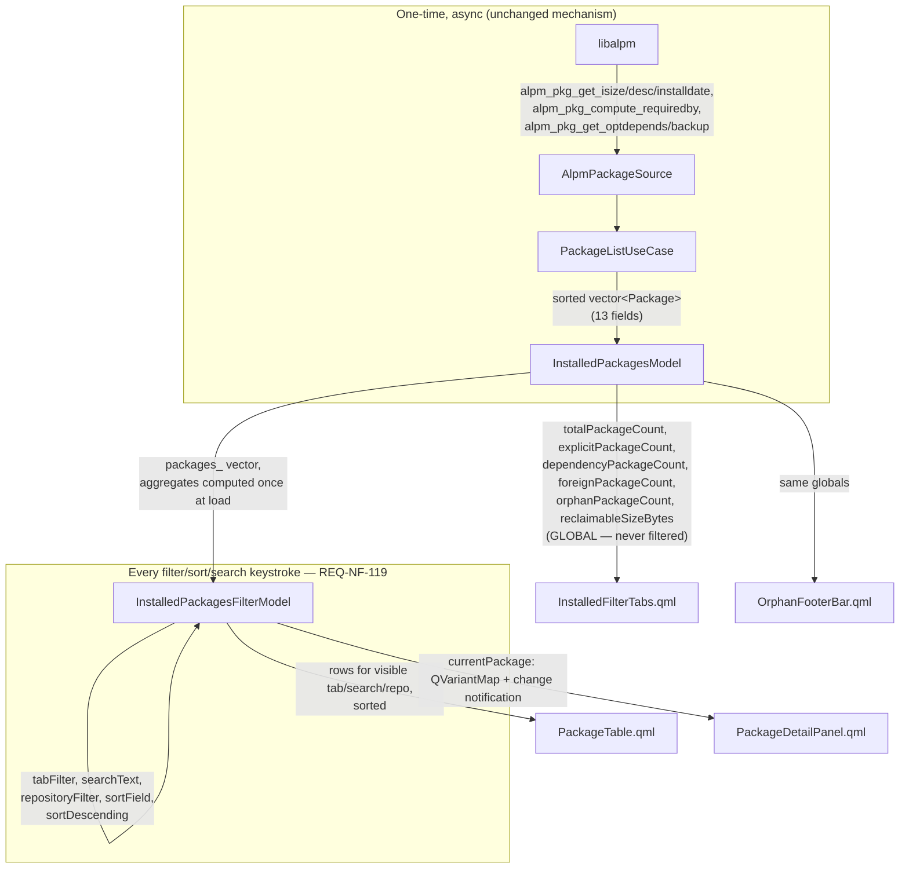

# Installed Page UI Redesign — Design

**Feature**: Redesign the Installed page from a bare single-column list into a filterable data table with a detail
panel, backed by an extended `Package` domain model and computed orphan statistics — transactionally inert.

**Status**: Implemented; review fixes verified, stakeholder acceptance pending

**Date**: 2026-09-05

**Input**: `docs/sdd/installed-page-ui/SPEC.md` (EARS requirements, referenced throughout as `REQ-*`)

---

## 0. Baseline this design extends

This is an incremental design on top of `docs/sdd/installed-packages-list/DESIGN.md` (already implemented): a
7-field `Package`, a `PackageSource` port, `AlpmPackageSource`, `PackageListUseCase` (sorts by name), and
`InstalledPackagesModel` (a `QAbstractListModel` with 4 roles: `NameRole`, `InstalledVersionRole`,
`SourceLabelRole`, `RepositoryRole`) rendered by a plain `ListView` in `InstalledPackagesView.qml`. Nothing in that
stack is replaced; it is extended in place. `WorkspaceWindow.qml` is currently a bare `Rectangle` with no sidebar —
this cycle adds one.

---

## 1. Components

### `src/domain/`

| File | Change |
|---|---|
| `include/holonight_packages_domain/package.h` | `Package` gains 6 fields (REQ-F-101): `sizeBytes` (`std::uint64_t`), `description` (`std::string`), `installDate` (`std::chrono::system_clock::time_point`), `requiredBy` (`std::vector<std::string>`), `optionalDependencies` (`std::vector<std::string>`), `configFileCount` (`std::size_t`). Needs `#include <chrono>`. `operator==` stays `= default` (no code change, but now compares all 13 fields). |

No change to `package_source.h` — the port's shape (`enumerateInstalledPackages() -> expected<vector<Package>, ...>`)
is unaffected by adding fields to the value type it returns.

### `src/backends/`

| File | Change |
|---|---|
| `src/alpm_package_source.cpp` | `toPackage()` gains a second step after building the base `Package` via the *unchanged* `detail::convertPackageFields(...)`: a new free function `populateExtendedFields(Package&, alpm_pkg_t*)` fills the 6 new fields from the same `alpm_pkg_t*`, in the same enumeration loop, before the package is pushed onto the result vector (REQ-F-102). See §3.2 for the exact libalpm calls. |
| `src/alpm_package_conversion.h` | **Unchanged.** `detail::convertPackageFields`'s signature and null-handling contract (name/version/repository) stay exactly as they are — see §4 for why this is deliberate. |

### `src/application/`

| File | Change |
|---|---|
| `include/holonight_packages_application/orphan_package_filter.h` (new) | `isOrphan(const Package&) -> bool` (REQ-F-103) and `computeOrphanStatistics(const vector<Package>&) -> OrphanStatistics` (REQ-F-104), as free functions — see §3.3. |
| `src/orphan_package_filter.cpp` (new) | Definitions. |
| `include/holonight_packages_application/package_size_formatter.h` (new) | `formatSizeBytes(std::uint64_t) -> std::string` — binary-unit human-readable formatting ("1.2 MiB"), used by the table, detail panel, and footer (REQ-F-112/114/117). |
| `src/package_size_formatter.cpp` (new) | Definition. |
| `package_list_use_case.h`/`.cpp` | **Unchanged.** See §4 for why orphan/size logic is *not* added as methods here. |

### `apps/packages/app/`

| File | Change |
|---|---|
| `InstalledPackagesModel.h`/`.cpp` | Gains 9 new roles and 7 new aggregate `Q_PROPERTY`s (REQ-F-105), computed once per successful load in `onEnumerationFinished()`. See §3.4. |
| `InstalledPackagesFilterModel.h`/`.cpp` (new) | `QSortFilterProxyModel` subclass owning all filter/sort/search/selection state (REQ-F-106–109, REQ-NF-119). QML-creatable (`QML_ELEMENT`). See §2 and §3.5. |
| `CMakeLists.txt` | Add the two new sources to `qt_add_executable(...)` and to `qt_add_qml_module(... SOURCES ...)` (the filter model needs QML registration, same as `InstalledPackagesModel` today). |

### `qml/packages/` (new/modified)

| File | Responsibility |
|---|---|
| `InstalledPackagesView.qml` (modified) | Top-level page root. Unchanged responsibility for the model's `Loading`/`Error`/empty-of-all-packages states (keeps the existing `loadingState`/`emptyState`/`errorState`/`packageList` `objectName`s so `installed_packages_view_test.cpp`'s structure is preserved — see §6). Owns one `InstalledPackagesFilterModel` instance wired to the injected `installedPackagesModel`. When `Loaded` and non-empty, composes the rest of this table below. |
| `InstalledToolbar.qml` (new) | Page title + `"N packages · X GiB"` subtitle (from `InstalledPackagesModel` aggregates), `HnSearchField` (REQ-F-107), sort `HnIconComboBox` (REQ-F-108), list/grid icon toggle (REQ-F-111), overflow `HnIconButton`. Repository and "All states" dropdowns are declared inline here too (see §4 — not worth their own files). |
| `InstalledFilterTabs.qml` (new) | The four pill tabs with count badges (REQ-F-106). Composed from `HnListDelegate`, **not** `HnSegmentedControl` — see §4/§5. |
| `PackageTable.qml` (new) | Horizontal `ScrollView` containing `PackageTableHeader` + a vertically scrolling `ListView` of `PackageTableRow`, plus a "no packages match your filters" empty state (an addition beyond SPEC's literal minimum, using the existing `HnEmptyState`, flagged in §4). |
| `PackageTableHeader.qml` (new) | Column header row (Package / Origin / Installed Version / Size / Reason) + select-all `CheckBox` (REQ-F-112/113). |
| `PackageTableRow.qml` (new, replaces `PackageRowDelegate.qml`) | One data row: extends `HnListDelegate` for selection styling/hover/focus (REQ-F-112), lays out the 5 columns + a leading visual-only checkbox (REQ-F-113). |
| `PackageOriginBadge.qml` (new) | Small reusable pill (e.g. "Official · Extra", "AUR") — shared by the table's Origin column and the detail panel header. |
| `PackageDetailPanel.qml` (new) | Right-hand panel container (`HnSurfaceFrame`, `Card`/`Panel` role). Shows `HnEmptyState` ("Select a package to view details") when `currentRow == -1`; otherwise composes the pieces below (REQ-F-114). |
| `PackageDetailHeader.qml` (new) | Icon, name, `PackageOriginBadge`×2, `HnStatusIndicator` ("Installed", `Success`), Remove button + more-options `HnIconButton` (REQ-F-115), wrapped in `HnPanelHeader` for the divider. |
| `PackageDetailMetadataRows.qml` (new) | Installed / Version / Size / Reason rows, each an `HnSettingsRow` (`titleText` = label, `trailingContent` = value `HnLabel`). |
| `PackageDetailDependencySections.qml` (new) | Full description; "Required by" (`HnSectionHeader` + count/list/"Safe to remove"); "Optional dependencies" (`HnSectionHeader` + chip `Flow` + "+N more"); "Local state" (`HnSectionHeader` + config file count). |
| `PackageDetailFooterLinks.qml` (new) | The Files/Dependencies/Changelog/Website row visible in the mockup, rendered via 4 disabled `HnActionDelegate`s (REQ-C-116 permits "omit or render inert"; rendering inert matches the mockup). |
| `OrphanFooterBar.qml` (new) | Footer bar via `HnActionBar` (leading = icon + "N orphaned packages · X reclaimable" from `InstalledPackagesModel`'s **global** aggregates, trailing = inert "Review" button) (REQ-F-117). |
| `PackageRowDelegate.qml` | **Removed** — superseded by `PackageTableRow.qml`. |

### `qml/workspace/`

| File | Change |
|---|---|
| `Sidebar.qml` (new) | Static nav rail: `HnAppTitle` branding, `HnNavigationDelegate` per nav item (Updates/Explore/History disabled with badge/no badge; Installed enabled and `checked: true`), "Last synced" static placeholder text, disabled Settings entry (REQ-C-116 item 10). |
| `WorkspaceWindow.qml` (modified) | `Rectangle` root becomes a `RowLayout` of `Sidebar` + `InstalledPackagesView`, instead of `InstalledPackagesView` filling the whole window. |

### `tests/`

| File | Change |
|---|---|
| `tests/domain/package_test.cpp` | Extend with the 6 new fields (construction/readback). |
| `tests/backends/alpm_package_source_test.cpp` | New cases: `sizeBytes`/`description` populated from fixture; `requiredBy` non-empty for a package another fixture package depends on; `optionalDependencies` populated; `configFileCount` from a fixture package with a `%BACKUP%` entry (fixture DB likely needs one new package with a dependent + a `%BACKUP%` line — a fixture change, not just a test change). |
| `tests/application/orphan_package_filter_test.cpp` (new) | The 3 fixture cases in REQ-F-103's acceptance criteria, plus REQ-F-104's 5-package aggregate case. |
| `tests/application/package_size_formatter_test.cpp` (new) | Boundary cases — see §6. |
| `tests/apps/installed_packages_model_test.cpp` | New cases for the 9 new roles + 7 aggregate properties (REQ-NF-118). |
| `tests/apps/installed_packages_filter_model_test.cpp` (new) | Tab filter, search, repository filter, sort, composition of all four, `currentRow` reconciliation on filter change (REQ-NF-118's "filter composition" coverage). |
| `tests/apps/installed_packages_view_test.cpp` | Existing 4 tests should keep passing unmodified against the preserved `objectName`s (see §6); regressions additionally cover selected-package replacement and refresh, readable and horizontally reachable table columns at default/minimum window sizes, and exclusive inert List/Grid selection. |

---

## 2. Data flow



Narrative:

1. **Load (unchanged mechanism, richer payload).** `InstalledPackagesModel` still uses `QtConcurrent::run` +
   `QFutureWatcher` exactly as today. The only change is that each `Package` in the resulting vector now carries 13
   fields instead of 7, and `onEnumerationFinished()` does one extra O(n) pass over `packages_` to compute the 7
   aggregate properties (§3.4) and cache them as plain members — so every subsequent `Q_PROPERTY` read is O(1), not
   recomputed per QML binding evaluation.
2. **Filtering/sorting/search never touch the backend (REQ-NF-119).** `InstalledPackagesFilterModel` wraps
   `InstalledPackagesModel` as its `sourceModel`. Changing `tabFilter`, `searchText`, `repositoryFilter`,
   `sortField`, or `sortDescending` uses `beginFilterChange()` / `endFilterChange(Rows)` or `invalidate()`/`sort()`, which re-evaluates
   `filterAcceptsRow()`/`lessThan()` purely against the already-loaded `packages_` vector via
   `sourceModel()->data(...)` calls on **cached in-memory roles** — no `AlpmPackageSource` method is ever
   reachable from this path. `QSortFilterProxyModel`'s C++ filter/sort is O(n log n) at worst for a full
   re-sort and comfortably clears the 100 ms budget at 5,000 rows (§6 for the one adjacent risk that *is* backend-side).
3. **Tab badges and the footer read GLOBAL aggregates, never the proxy's filtered row count** (REQ-F-106 badges,
   REQ-F-117 footer). Both bind directly to `InstalledPackagesModel`'s properties, which are computed once at load
   and are unaffected by anything the proxy does — this is what makes "changing the tab from Explicit to Orphans
   does not change the footer's orphan count" (REQ-F-117 acceptance criterion) true by construction rather than by
   convention.
4. **Detail panel binds to `currentPackage`.** The proxy caches the selected package's role map and emits
   `currentPackageChanged` when its identity or metadata changes, including when the proxy row stays the same.
   `currentRow` still drives the table highlight. Empty selections use the panel's fully keyed placeholder map.
5. **Selection is reconciled once per completed filter change.** `beginFilterChange()` / `endFilterChange(Rows)`
   can emit many separate insertion/removal ranges. Reconciliation is suspended for those intermediate signals,
   then scans once for the retained package name and publishes the final selection. Sorting and source resets
   also reconcile selection; source data changes refresh the selected role map.
6. **Narrow tables scroll horizontally.** The table maintains an 850 px content width and scrolls its header and
   rows together; the list independently scrolls vertically. Below 780 px of page content width, the detail panel
   moves below the table. This preserves readable package names at the default and minimum window sizes.


---

## 3. Interfaces

### 3.1 `Package` (domain) — REQ-F-101

```cpp
// src/domain/include/holonight_packages_domain/package.h
#pragma once

#include <chrono>
#include <cstdint>
#include <string>
#include <vector>

namespace holonight_packages_domain {

enum class SourceType : std::uint8_t { Official, Foreign };
enum class InstallReason : std::uint8_t { Explicit, Dependency };

struct Package {
  std::string identity;
  std::string name;
  std::string installedVersion;
  SourceType sourceType = SourceType::Foreign;
  std::string repository;
  InstallReason installReason = InstallReason::Explicit;
  std::string backendSpecificId;

  std::uint64_t sizeBytes = 0;
  std::string description;
  std::chrono::system_clock::time_point installDate{};
  std::vector<std::string> requiredBy;
  std::vector<std::string> optionalDependencies;
  std::size_t configFileCount = 0;

  bool operator==(const Package&) const = default;
};

}  // namespace holonight_packages_domain
```

### 3.2 `AlpmPackageSource` extension (backends) — REQ-F-102

```cpp
// src/backends/src/alpm_package_source.cpp (new free function, anonymous namespace)
void populateExtendedFields(Package& package, alpm_pkg_t* pkg) {
  const off_t installed_size = alpm_pkg_get_isize(pkg);  // bytes, per libalpm
  package.sizeBytes = installed_size > 0 ? static_cast<std::uint64_t>(installed_size) : 0;

  const char* description = alpm_pkg_get_desc(pkg);
  package.description = description != nullptr ? description : "";

  package.installDate = std::chrono::system_clock::from_time_t(
      static_cast<std::time_t>(alpm_pkg_get_installdate(pkg)));

  // alpm_pkg_compute_requiredby ALLOCATES a new list of newly-strdup'd strings — caller must free
  // both the strings and the list (unlike the borrowed-pointer alpm_pkg_get_* accessors below).
  alpm_list_t* required_by = alpm_pkg_compute_requiredby(pkg);
  for (alpm_list_t* node = required_by; node != nullptr; node = alpm_list_next(node)) {
    package.requiredBy.emplace_back(static_cast<const char*>(node->data));
  }
  alpm_list_free_inner(required_by, free);
  alpm_list_free(required_by);

  // alpm_pkg_get_optdepends returns the package's OWN cached list — do not free the list or its
  // alpm_depend_t* entries; only the string alpm_dep_compute_string() allocates needs freeing.
  for (alpm_list_t* node = alpm_pkg_get_optdepends(pkg); node != nullptr; node = alpm_list_next(node)) {
    auto* dependency = static_cast<alpm_depend_t*>(node->data);
    char* dependency_string = alpm_dep_compute_string(dependency);
    if (dependency_string != nullptr) {
      package.optionalDependencies.emplace_back(dependency_string);
      free(dependency_string);
    }
  }

  // alpm_pkg_get_backup is also a borrowed cached list — just count it.
  package.configFileCount = static_cast<std::size_t>(alpm_list_count(alpm_pkg_get_backup(pkg)));
}
```

`toPackage()` calls this immediately after the existing `convertPackageFields(...)` call succeeds, on the same
`alpm_pkg_t*`, before pushing the `Package` into the result vector — one enumeration pass, no extra libalpm
round-trips, satisfying REQ-F-102's constraint literally.

### 3.3 Orphan computation and size formatting (application) — REQ-F-103/104

```cpp
// src/application/include/holonight_packages_application/orphan_package_filter.h
#pragma once

#include "holonight_packages_domain/package.h"

#include <cstdint>
#include <vector>

namespace holonight_packages_application {

[[nodiscard]] bool isOrphan(const holonight_packages_domain::Package& package);

struct OrphanStatistics {
  int orphanPackageCount = 0;
  std::uint64_t reclaimableSizeBytes = 0;
};

[[nodiscard]] OrphanStatistics computeOrphanStatistics(
    const std::vector<holonight_packages_domain::Package>& packages);

}  // namespace holonight_packages_application
```

```cpp
// isOrphan definition
bool isOrphan(const Package& package) {
  return package.installReason == InstallReason::Dependency && package.requiredBy.empty();
}
```

```cpp
// src/application/include/holonight_packages_application/package_size_formatter.h
#pragma once

#include <cstdint>
#include <string>

namespace holonight_packages_application {

// Binary (IEC) units: "0 B", "234 KiB", "1.2 MiB", "12.6 GiB". Trailing ".0" is trimmed
// (e.g. exactly 186.0 MiB renders as "186 MiB", matching the footer example in the mockup).
[[nodiscard]] std::string formatSizeBytes(std::uint64_t bytes);

}  // namespace holonight_packages_application
```

### 3.4 `InstalledPackagesModel` extension (apps/packages/app) — REQ-F-105

```cpp
class InstalledPackagesModel : public QAbstractListModel {
  Q_OBJECT
  QML_NAMED_ELEMENT(InstalledPackagesModel)
  QML_UNCREATABLE("InstalledPackagesModel is provided by the application")
  Q_PROPERTY(Status status READ status NOTIFY statusChanged)
  Q_PROPERTY(QString errorMessage READ errorMessage NOTIFY statusChanged)
  Q_PROPERTY(int totalPackageCount READ totalPackageCount NOTIFY statusChanged)
  Q_PROPERTY(quint64 totalInstalledSizeBytes READ totalInstalledSizeBytes NOTIFY statusChanged)
  Q_PROPERTY(int explicitPackageCount READ explicitPackageCount NOTIFY statusChanged)
  Q_PROPERTY(int dependencyPackageCount READ dependencyPackageCount NOTIFY statusChanged)
  Q_PROPERTY(int foreignPackageCount READ foreignPackageCount NOTIFY statusChanged)
  Q_PROPERTY(int orphanPackageCount READ orphanPackageCount NOTIFY statusChanged)
  Q_PROPERTY(quint64 reclaimableSizeBytes READ reclaimableSizeBytes NOTIFY statusChanged)

 public:
  enum class Status : std::uint8_t { Loading, Loaded, Error };
  Q_ENUM(Status)

  enum Role : std::uint16_t {
    NameRole = Qt::UserRole + 1,
    InstalledVersionRole,
    SourceLabelRole,
    RepositoryRole,
    InstallReasonRole,         // QString: "explicit" | "dependency" — needed for the Reason column (not in REQ-F-105's list; see §4)
    SizeRole,                  // quint64, raw bytes — for the proxy model's numeric sort
    SizeLabelRole,              // QString, e.g. "31.8 MiB" — for display
    DescriptionRole,           // QString
    InstallDateRole,           // QDateTime
    RequiredByCountRole,       // int
    RequiredByListRole,        // QStringList — needed by the detail panel's list (not in REQ-F-105's list; see §4)
    OptionalDependenciesRole,  // QStringList
    ConfigFileCountRole,       // int
    IsOrphanRole,              // bool
  };

  // ... existing constructor/rowCount/data/roleNames/status/errorMessage/refresh unchanged in shape ...

  [[nodiscard]] int totalPackageCount() const;
  [[nodiscard]] quint64 totalInstalledSizeBytes() const;
  [[nodiscard]] int explicitPackageCount() const;
  [[nodiscard]] int dependencyPackageCount() const;
  [[nodiscard]] int foreignPackageCount() const;
  [[nodiscard]] int orphanPackageCount() const;
  [[nodiscard]] quint64 reclaimableSizeBytes() const;

  Q_INVOKABLE QString formatSize(quint64 bytes) const;  // thin wrapper over formatSizeBytes(), reused by
                                                          // header/footer QML for aggregate sizes

 private:
  // ... existing members ...
  struct Aggregates {
    int total_package_count = 0;
    quint64 total_installed_size_bytes = 0;
    int explicit_package_count = 0;
    int dependency_package_count = 0;
    int foreign_package_count = 0;
    int orphan_package_count = 0;
    quint64 reclaimable_size_bytes = 0;
  };
  Aggregates aggregates_;  // recomputed once in onEnumerationFinished(), O(1) reads thereafter
};
```

`onEnumerationFinished()` gains one loop over the freshly-loaded `packages_` (after `endResetModel()`) that fills
`aggregates_` — a single `std::ranges::count_if`/accumulate pass per counter, plus one call to
`holonight_packages_application::computeOrphanStatistics(packages_)` for the two orphan aggregates.

### 3.5 `InstalledPackagesFilterModel` (apps/packages/app, new) — REQ-F-106–109, REQ-NF-119

```cpp
#pragma once

#include "InstalledPackagesModel.h"

#include <QSortFilterProxyModel>
#include <QString>
#include <QVariantMap>
#include <QtQmlIntegration/qqmlintegration.h>

#include <cstdint>

class InstalledPackagesFilterModel : public QSortFilterProxyModel {
  Q_OBJECT
  QML_ELEMENT
  Q_PROPERTY(TabFilter tabFilter READ tabFilter WRITE setTabFilter NOTIFY tabFilterChanged)
  Q_PROPERTY(QString searchText READ searchText WRITE setSearchText NOTIFY searchTextChanged)
  Q_PROPERTY(QString repositoryFilter READ repositoryFilter WRITE setRepositoryFilter NOTIFY repositoryFilterChanged)
  Q_PROPERTY(SortField sortField READ sortField WRITE setSortField NOTIFY sortFieldChanged)
  Q_PROPERTY(bool sortDescending READ sortDescending WRITE setSortDescending NOTIFY sortDescendingChanged)
  Q_PROPERTY(int currentRow READ currentRow WRITE setCurrentRow NOTIFY currentRowChanged)
  Q_PROPERTY(QVariantMap currentPackage READ currentPackage NOTIFY currentPackageChanged)
  Q_PROPERTY(QStringList availableRepositories READ availableRepositories NOTIFY availableRepositoriesChanged)

 public:
  enum class TabFilter : std::uint8_t { Explicit, Dependencies, Foreign, Orphans };
  Q_ENUM(TabFilter)
  enum class SortField : std::uint8_t { Name, Size };
  Q_ENUM(SortField)

  explicit InstalledPackagesFilterModel(QObject* parent = nullptr);

  void setSourceModel(QAbstractItemModel* source_model) override;

  [[nodiscard]] TabFilter tabFilter() const;
  void setTabFilter(TabFilter filter);
  [[nodiscard]] QString searchText() const;
  void setSearchText(const QString& text);
  [[nodiscard]] QString repositoryFilter() const;
  void setRepositoryFilter(const QString& repository);
  [[nodiscard]] SortField sortField() const;
  void setSortField(SortField field);
  [[nodiscard]] bool sortDescending() const;
  void setSortDescending(bool descending);
  [[nodiscard]] int currentRow() const;
  [[nodiscard]] QVariantMap currentPackage() const;
  void setCurrentRow(int row);
  [[nodiscard]] QStringList availableRepositories() const;

  // QML-facing "give me the whole row as a map" — the standard workaround for QAbstractItemModel
  // not exposing data() to QML directly. Keys are roleNames() values.
  Q_INVOKABLE QVariantMap get(int row) const;

 signals:
  void tabFilterChanged();
  void searchTextChanged();
  void repositoryFilterChanged();
  void sortFieldChanged();
  void sortDescendingChanged();
  void currentRowChanged();
  void currentPackageChanged();
  void availableRepositoriesChanged();

 protected:
  [[nodiscard]] bool filterAcceptsRow(int source_row, const QModelIndex& source_parent) const override;
  [[nodiscard]] bool lessThan(const QModelIndex& left, const QModelIndex& right) const override;

 private:
  void reconcileCurrentRow();  // model reset/layout/row/data signals; deferred inside filter operations

  TabFilter tab_filter_ = TabFilter::Explicit;
  QString search_text_;
  QString repository_filter_;
  SortField sort_field_ = SortField::Name;
  bool sort_descending_ = false;
  QString active_package_identity_;  // tracks selection across re-filter/re-sort — see §4
  int current_row_ = -1;
  QVariantMap current_package_;
  bool filter_change_in_progress_ = false;
};
```

QML usage (inside `InstalledPackagesView.qml`):

```qml
InstalledPackagesFilterModel {
    id: filterModel
    sourceModel: root.installedPackagesModel
    // REQ-F-106: the C++ member initializer already defaults to Explicit.
}
```

Do not add the redundant declarative enum binding here: it crashes `qmlcachegen` on Qt 6.11.2.
See [the compiler issue](../../known-issues/qmlcachegen-enum-binding-crash.md). Table rows and filter tabs
extend the public `HnListDelegate`, because `HnSelectableDelegate` is internal to the design system;
see [the internal-type tooling gap](../../known-issues/qmllint-does-not-enforce-internal-types.md).

---

## 4. Key decisions with rationale

| Decision | Rationale |
|---|---|
| **Filter/sort/search state lives in a `QSortFilterProxyModel` subclass, not inside `InstalledPackagesModel` and not in QML.** | `QSortFilterProxyModel` is the idiomatic Qt mechanism for exactly this: it operates purely on the source model's already-cached role data (REQ-NF-119's in-memory constraint is then a structural fact, not a discipline the team has to maintain), gives incremental filter invalidation and sorting instead of full JS-side array rebuilds, and keeps `InstalledPackagesModel` a pure data/aggregate holder — the same separation the base design already established between "loading" (model) and "presentation" (QML). Hand-rolling filtering inside `InstalledPackagesModel` would conflate "what was loaded" with "what's currently visible," breaking the clean global-aggregate story in the next row. |
| **Tab badges and the footer bind to `InstalledPackagesModel`'s aggregates, never to the proxy's filtered row count.** | REQ-F-117 explicitly requires the footer to reflect *totals*, independent of the active tab/search/repo filter; the mockup's tab counts (312/1,846/23/3) are consistent with fixed global category counts, not counts that shrink as you type into search. Sourcing both from the same one-time-computed aggregate struct means there is only one place these numbers can disagree, and they're O(1) property reads with no per-keystroke recomputation. |
| **Active/selected row tracked by package identity, not raw proxy row index.** | REQ-F-112 says the first row is selected by default and, if the active row is *filtered out*, the first remaining row becomes active — implying a package that's still visible after a filter/sort change (just reordered) should **stay** selected rather than visually jumping to row 0 on every keystroke. `InstalledPackagesFilterModel` stores `active_package_identity_` internally; `currentRow` is exposed as a proxy-row *view* of that identity (tracked by installed package name), recomputed once after each complete filter operation or model layout/reset change. Setting `currentRow` from QML (a row click) updates the stored identity, not just an integer. |
| **`convertPackageFields()`'s existing 5-argument signature is untouched; the 6 new fields are filled by a separate `populateExtendedFields()` step in `toPackage()`.** | REQ-F-102's acceptance criteria requires existing tests to keep passing *without modification*, and `alpm_package_source_test.cpp`'s `AlpmPackageConversion.*` tests call `convertPackageFields(...)` with exactly 5 arguments today, asserting null-checks specifically for name/version/repository. Extending that signature (even with defaults) would blur a function whose entire tested contract is "identity-field null handling" with six more fields that have a completely different null-safety story (they come from libalpm accessors that are borrowed/guaranteed-valid for a live `alpm_pkg_t*`, never null-checked anywhere in the codebase today). Keeping them as a separate mutation step is a smaller, more legible diff and a strictly smaller blast radius. |
| **`InstallReasonRole` and `RequiredByListRole` are added even though REQ-F-105 doesn't name them.** | The Reason table column (REQ-F-112) needs a *displayable* install-reason string somewhere, and REQ-F-105's role list has no such role (only the domain field exists); likewise REQ-F-114's "Required by" section needs the *names*, not just the count REQ-F-105 does list. Both are one-line additions to the same `switch` in `data()`/`roleNames()`, and both are exactly the kind of "add a role when a concrete consumer exists" extension the base design's own precedent already establishes (§6 of the prior DESIGN.md). |
| **Size is exposed as two roles: `SizeRole` (raw `quint64`) and `SizeLabelRole` (formatted `QString`).** | The proxy model's `lessThan()` for size sort needs a numeric comparison; the table/detail panel need "31.8 MiB". Doing the MiB/GiB formatting once in tested C++ (`formatSizeBytes`) instead of duplicating rounding/unit-boundary logic in QML (table cell, detail panel, header subtitle, footer) means there is exactly one place the "234 KiB" vs. "1.2 MiB" boundary logic can be wrong, and it's covered by a focused GTest file (§6). |
| **`InstallDateRole` is `QDateTime`, formatted in QML via `Qt.formatDateTime`, not a pre-formatted C++ string role.** | Unlike size, Qt's own `QDateTime`/`Qt.formatDateTime` already handles locale-aware "MMM DD, YYYY HH:MM" formatting natively and idiomatically from QML with no extra C++. Exposing the raw `QDateTime` also leaves room for a future date-based sort without adding another role. |
| **Remove/more-options/Review buttons stay visually "live" (matching the mockup's red-outlined Remove button) but are wired no-op, with a tooltip.** | REQ-F-115 accepts disabled-appearance OR tooltip OR no-op (any one suffices), and the mockup's Appendix explicitly asks for visual fidelity. Graying out the Remove button would deviate from the mockup more than necessary; a no-op `onClicked` + `ToolTip.text: qsTr("Not implemented yet")` on hover satisfies the requirement's substance (no mutation, no false success message, clearly signposted) without sacrificing pixel fidelity. |
| **Filter tabs are composed from the public `HnListDelegate` in a `Row`, not `HnSegmentedControl`.** | `HnSegmentedControl` renders plain text-only equal-width segments with no slot for a trailing count badge or the Orphans tab's status dot — see §5. `HnListDelegate` exposes the internal `HnSelectableDelegate` selection behavior through a public type and provides the selected-pill background/hover/focus styling the mockup's active "Explicit" tab shows, and its `contentItem` is fully overridable, so a badge `Rectangle`+`HnLabel` composes in naturally. |
| **The data table (header + rows) is hand-composed from primitives, not a new `Hn*` control.** | No `Hn*` component in the design-system repo represents a multi-column table with independently-sized, header-aligned columns. `PackageTableRow` reuses `HnListDelegate` for the row-selection behavior (the one piece that *does* have a ready-made fit) and lays out the 5 columns itself with a `RowLayout`; `PackageTableHeader` mirrors the same column-width scheme so header and rows stay aligned. This is intentionally scoped as app-local (`qml/packages/`) composition, not a new shared `Hn*` name, since a real reusable "data table" control is a bigger design-system investment than this one page's SPEC calls for. |
| **`HnSettingsRow` reused for the 4 detail-panel metadata rows; `HnSectionHeader` reused for "Required by"/"Optional dependencies"/"Local state"; `HnActionBar` reused for the footer bar; `HnPanelHeader` wraps the detail header's divider.** | All four already implement exactly the layout shape needed (label+trailing value; title+description+divider; leading/center/trailing with a divider; content+divider) — using them is strictly less code than re-deriving the same `RowLayout`+`Rectangle` divider pattern four more times. |
| **Sort is one `HnIconComboBox` with 4 fixed entries ("Name A→Z", "Name Z→A", "Size Large→Small", "Size Small→Large"), not a field-picker plus a separate direction toggle.** | The mockup shows a single dropdown ("Name" with a chevron), not two controls. Encoding field+direction as one entry each keeps the toolbar visually identical to the mockup while still satisfying REQ-F-108's "supports both directions" requirement — the user reaches Z→A by picking the other entry, not by re-clicking the same one (see §5 for the alternative). |
| **Repository dropdown's option list comes from `InstalledPackagesFilterModel::availableRepositories()`, computed from the *source* model, not the *filtered* proxy.** | REQ-F-109 says "one option per unique value in the `repository` field **across all packages**" — the option list itself must not shrink as other filters are applied, only the resulting rows do. |

---

## 5. Alternatives considered

**Filter/sort/search state management**

| Alternative | Pros | Cons | Verdict |
|---|---|---|---|
| Hand-rolled filtering inside `InstalledPackagesModel` (a second internal `filtered_indices_` vector, recomputed on every setter) | No new class; one file to reason about | Conflates "loaded" and "visible" in the same object; every new filter dimension is another manual re-derivation of `filtered_indices_`; no free incremental invalidation — Qt's proxy model already solved this | Rejected |
| Filtering/sorting done in QML/JS (a `ListModel`-of-`QVariantMap`s or manual JS array filter over role data pulled into a JS array) | No C++ at all | Requires copying every row's data out of the C++ model into a JS array up front (defeats `ListView`'s virtualization), re-filtering 5,000 JS objects per keystroke is far more likely to blow the 100 ms/60 fps budgets (REQ-NF-119) than native C++ `QSortFilterProxyModel`, and duplicates role-shape knowledge in two languages | Rejected |
| `QSortFilterProxyModel` subclass (**chosen**) | Idiomatic, incremental invalidation, purely in-memory over cached roles, composes with `ListView` for free | One more class, one more file pair | **Chosen** |

**`currentRow` selection tracking**

| Alternative | Pros | Cons | Verdict |
|---|---|---|---|
| `currentRow` as a plain proxy-row integer, reset to 0 on every `invalidate()` | Trivial to implement | Selection visibly "jumps" to the top row on every keystroke in the search field even when the previously-selected package is still visible, just reordered — jarring UX not implied by REQ-F-112's wording | Rejected |
| Track by identity, `currentRow` derived (**chosen**) | Selection survives reordering; only resets when the package actually leaves the filtered set, matching REQ-F-112's literal "if the active row is filtered out" condition | Slightly more bookkeeping (identity↔row lookup on every `invalidate()`) | **Chosen** |

**Sidebar shell**

| Alternative | Pros | Cons | Verdict |
|---|---|---|---|
| Leave `WorkspaceWindow.qml` as a bare `Rectangle` and overlay a floating nav strip only inside `InstalledPackagesView.qml` | Smallest diff | Doesn't match the mockup's persistent full-height sidebar; couples app-shell chrome to one feature's view, wrong layer for something REQ-C-116 explicitly calls "left sidebar navigation" (i.e. app-shell-level, not page-level) | Rejected |
| New `Sidebar.qml` composed into `WorkspaceWindow.qml` via `RowLayout` (**chosen**) | Matches mockup; puts shell-level chrome at the shell level; `HnAppTitle`/`HnNavigationDelegate` are exact-fit reuse | One more file; `WorkspaceWindow.qml`'s structure changes (low risk — no test currently exercises it directly) | **Chosen** |
| A real page-router/stack (`StackView`, or a `Loader`-based page switcher) so Explore/History/etc. are "real" disabled routes | More architecturally complete, forward-looking | Pure overbuild for this cycle — REQ-C-116 explicitly keeps every other page as a static/disabled placeholder; no second page exists to route to yet | Rejected for now; revisit when a second page is actually built |

**Sort control shape**

| Alternative | Pros | Cons | Verdict |
|---|---|---|---|
| Single `HnIconComboBox` with 4 field+direction entries (**chosen**) | Matches mockup's single dropdown exactly; one control, one binding | "Selecting Name again toggles direction" (as literally worded in one acceptance bullet) isn't how it behaves — the user instead picks a different entry | **Chosen**; functionally equivalent, still reaches both directions |
| `HnIconComboBox` (field only) + separate ascending/descending `HnIconButton` | Matches the acceptance bullet's toggle wording precisely | Adds a second control not present in the mockup, growing the toolbar's visual footprint beyond the reference design | Rejected — mockup fidelity outweighs literal-wording match here, and the acceptance intent (both directions reachable) is preserved either way |

---

## 6. Known risks

- **`alpm_pkg_compute_requiredby` is O(n) per package (it scans every other installed package's dependency list),
  making full enumeration O(n²).** At real-world Arch package counts (roughly 800–2,500 packages on a typical
  desktop) this is not likely to be perceptible. At the SPEC's 5,000-package stress-test scale it could meaningfully
  lengthen the *load* spinner. This is **not** the same budget as REQ-NF-119's 100 ms figure — that requirement
  governs post-load filter/sort/search operations on already-cached data, which stay fast regardless of how long
  the initial libalpm enumeration took, because the whole enumeration already runs off the GUI thread via
  `QtConcurrent::run`. Net: accepted as a known risk for this cycle (REQ-F-101 explicitly names
  `alpm_pkg_compute_requiredby` as the sanctioned API, so substituting a hand-rolled inverse-dependency index built
  from `alpm_pkg_get_depends()` in one O(n·avg_deps) pass — libalpm's own internal approach, minus its
  provides/virtual-package resolution — is a viable future optimization if profiling on a large real system shows
  the spinner duration is actually a problem, but is not built now).
- **libalpm memory ownership is easy to get backwards.** `alpm_pkg_compute_requiredby`/`alpm_dep_compute_string`
  allocate and must be freed by the caller (`alpm_list_free_inner(list, free)` + `alpm_list_free(list)`, or a bare
  `free()` for the depend string); `alpm_pkg_get_optdepends`/`alpm_pkg_get_backup` return the package's own cached,
  borrowed lists and must **not** be freed. Mixing these up either leaks memory or double-frees/corrupts libalpm's
  internal cache. `clang-tidy` won't catch this reliably; it needs an explicit code-review checklist item and,
  ideally, an ASan test run over the fixture DB during implementation.
- **Repository filter's "unique value" set includes the empty string.** `Package.repository` is `""` for
  `SourceType::Foreign` packages (AUR/foreign), so REQ-F-109's literal "one option per unique value in the
  `repository` field" would otherwise produce a blank, unlabeled dropdown entry. `availableRepositories()` should
  either omit the empty string (foreign packages are already reachable via the AUR/Foreign tab) or label it
  explicitly (e.g. "None") — a small UX call left for implementation, not resolved by this design.
- **`qmllint` compliance for the new QML tree.** All new delegates (`PackageTableRow`, tab items, chip repeaters)
  must use `pragma ComponentBehavior: Bound` and `required property` for every role they bind, matching the
  existing `PackageRowDelegate.qml` convention — `task qml-lint` is a hard gate (REQ-NF-120).
- **`InstalledPackagesFilterModel` is new surface area with no precedent test file in this codebase** (the base
  design has no proxy model to model tests after). Testing strategy: construct it directly in C++ against a
  `MockPackageSource`-backed `InstalledPackagesModel` (same pattern as `installed_packages_model_test.cpp`), set
  `sourceModel`, then exercise `tabFilter`/`searchText`/`repositoryFilter`/`sortField`/`sortDescending` combinations
  and assert `rowCount()`/`get(row)` — no QML engine needed for the filtering logic itself, only
  `installed_packages_view_test.cpp`-style tests need a live `QQmlEngine`.
- **Existing `installed_packages_view_test.cpp` structural coupling.** That file's `createView()`/`stateObject()`
  helpers locate children by `objectName` (`loadingState`, `emptyState`, `errorState`, `packageList`) inside
  whatever `InstalledPackagesView.qml` becomes. This design preserves those four `objectName`s on the equivalent
  elements in the redesigned tree (the loading/error/empty states stay siblings of the new toolbar/table/detail
  composition, gated the same way), but this is a real constraint implementation must honor precisely — accidental
  renaming would silently break 4 passing tests without any compile error (QML `objectName` lookups fail silently
  at runtime, not at build time).
- **`PackageSizeFormatter`'s trailing-".0" trimming needs explicit boundary tests.** At minimum: `0` → `"0 B"`;
  `1023` → `"1023 B"`; `1024` → `"1 KiB"`; `1024*1024 - 1` → `"1024 KiB"` (not `"1.0 MiB"` — verify the rounding
  direction chosen doesn't cross a unit boundary); `1024*1024*1.5` → `"1.5 MiB"`; an exact multiple like
  `195035136` (186 MiB) → `"186 MiB"` (matching the mockup's footer, not `"186.0 MiB"`).

---

## Related Documents

- **Acceptance evidence**: `docs/sdd/installed-page-ui/ACCEPTANCE.md`
- **Specification**: `docs/sdd/installed-page-ui/SPEC.md`
- **Prior design this extends**: `docs/sdd/installed-packages-list/DESIGN.md`
- **Codebase reference**: `CLAUDE.md`
- **Visual reference**: `docs/mockups/installed.png`
- **Design system**: `../holonight-qt/qml/controls/` (`Hn*.qml`), `../holonight-qt/qml/*.qml` (`Holonight as H` wrappers)

---

## Change History

| Version | Date | Author | Notes |
|---|---|---|---|
| 1.0 | 2026-09-05 | SDD Process | Initial design derived from SPEC.md v1.0 |
| 1.1 | 2026-09-05 | Review fixes | Selected-package notification, batched selection reconciliation, responsive table scrolling, public delegate types, exclusive List/Grid selection. |
